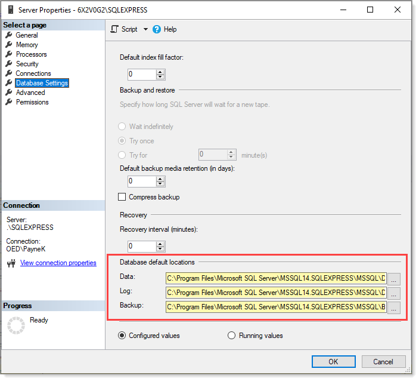

# About

- [Different ways to change database owners in SQL Server](https://www.sqlshack.com/different-ways-to-change-database-owners-in-sql-server/)

### Get owners for each database

```sql
USE [master];
GO
SELECT db.name AS [Database Name], 
       sp.name [SQL Login Name]
FROM sys.databases db
     LEFT JOIN sys.server_principals sp ON db.owner_sid = sp.sid
WHERE database_id > 5;
```

### View or Change the Default Locations for Data and Log Files

- Microsoft [docs](https://docs.microsoft.com/en-us/sql/database-engine/configure-windows/view-or-change-the-default-locations-for-data-and-log-files?view=sql-server-ver15)
- sql shack [How to move SQL database files (MDF and LDF) to another location](https://www.sqlshack.com/move-sql-database-files-mdf-ldf-another-location/)

View or change the default locations for database files

1. In Object Explorer, right-click on your server and click Properties.
2. In the left panel on that Properties page, click the Database settings tab.
3. In `Database default locations`, view the current default locations for new data files and new log files. To change a default location, enter a new default pathname in the Data or Log field, or click the browse button to find and select a pathname.

**NOTE**: After changing the default locations, you must stop and start the SQL Server service to complete the change.


