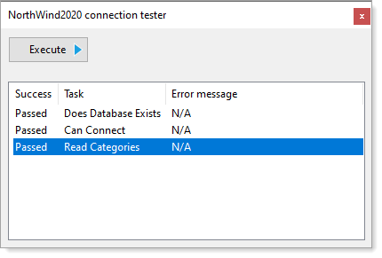

## NorthWindConnections

This utility test if the current user can connect to the following database which I've offered to the service desk to use an alternate location `C:\OED\Dotnetland\VS2019\NorthData` for working with a local SQL-Server database.

If they are open to this a developer can run this utility directly inside of Visual Studio or from Windows Explorer.

We will not be going over the code in this project but if time permits each developer should at least check the code out.

Although this code is extremely simple for experienced developers, this is not the case for novice developers. 
The average non-professional (and even some professional) developer/coder have little to no expertise working with 
[delegates](https://docs.microsoft.com/en-us/dotnet/csharp/programming-guide/delegates/) and 
[events](https://docs.microsoft.com/en-us/dotnet/csharp/programming-guide/events/) at any level 
where this code does use events. Check out this [Pluralsight course](https://app.pluralsight.com/library/courses/csharp-events-delegates/table-of-contents).

Delegate/event

```csharp
public delegate void OnTaskCompleted(Task sender);
public static event OnTaskCompleted Completed;
```

**Task**

- Does database exists?
- Can connect to database?
- Can read from database?



| Visual Studio on S drive if unable to get from GitHub  |
| :--- |
| S:\APPLICATIONS\VisualStudioTraining\VisualStudioTraining-week5 |
